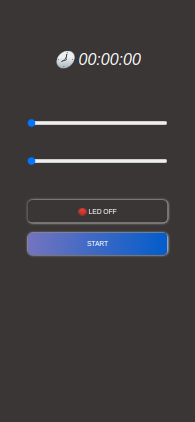

<div align="center">


</div>
<br/>
<br/>

## **💻 Project**

<p align="center">

</p>

Esse projeto consiste em uma interface web criada em ReactJS para o firmware deste outro [projeto](https://github.com/tpaphysics/esp8266-countdown-relay) que consiste em um cronometro regressivo para acionamento remoto de um relé usando o microcontrolador ESP8266.

## **🚀 Get Started**

1. Obtenha o o build do projeto

```bash
yarn build
```

2. Após o build, será criada a pasta **_/dist_**, renomeie os arquivos **.js** e **.css** para **index.js** e **index.css** e mude também no arquivo index.html a tag **_link_** e tag **_scrpit_** :

```html
<!DOCTYPE html>
<html lang="en">
  <head>
    <meta charset="UTF-8" />
    <link rel="icon" type="image/svg+xml" href="/src/favicon.svg" />
    <meta name="viewport" content="width=device-width, initial-scale=1.0" />
    <title>ESP8266</title>
    <script type="module" crossorigin src="/assets/index.js"></script>
    <link rel="stylesheet" href="/assets/index.css" />
  </head>
  <body>
    <div id="root"></div>
  </body>
</html>
```

3. Agora renomeie a pasta **_dist_** para **_data_** e copie ela para o diretorio corrente do [projeto com ESP8266](https://github.com/tpaphysics/esp8266-countdown-relay).

## **👨‍🚀 Autor**

👋 My contacts!

[](https://www.linkedin.com/in/thiago-pacheco-200a1a86/)
[](mailto:physics.posgrad.@gmail.com)

## **📝 Licença**

Este projeto está sob os termos [Apache Licence v2.0](/LICENCE)
